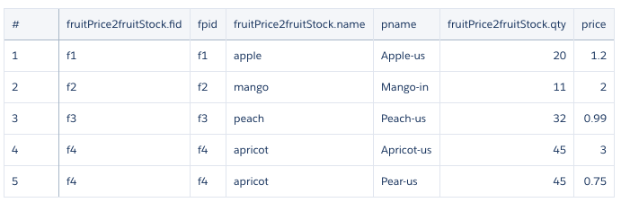

## Augment operation notes
```bash

$ cat fruit-price.csv 
fpid,pname,price
f1,Apple-us,1.2
f2,Mango-in,1.99
f3,Peach-us,0.99
f4,Apricot-us,2.99
f4,Pear-us,0.75


$ cat fruit-stock.csv 
fid,name,qty
f1,apple,20
f2,mango,11
f3,peach,32
f4,apricot,45
f4,pear,72
~/einstein/EA/notes:
 


#------ Load fruit-stock.csv
Available Datasetutil Actions: 
   1. Load CSV
   2. Define SFDC Extract Data Flow
   3. Define Dataset Augment Data Flow
   4. Download All XMD Json Files
   5. Upload User XMD Json File
   6. Detect file encoding
   7. Fetch CSV Upload Error Report

Enter Action number (0  = Exit): 1
Enter inputFile: fruit-stock.csv
Enter dataset name: fruitStock
Enter datasetLabel (Optional): 
Enter datasetFolder (Optional): 
Enter Operation (Default=Overwrite):    
Enter fileEncoding (Optional): 
Parse file before uploading (Yes/No): Yes


#------ load fruit-price.csv

Available Datasetutil Actions: 
   1. Load CSV
   2. Define SFDC Extract Data Flow
   3. Define Dataset Augment Data Flow
   4. Download All XMD Json Files
   5. Upload User XMD Json File
   6. Detect file encoding
   7. Fetch CSV Upload Error Report

Enter Action number (0  = Exit): 1
Enter inputFile: fruit-price.csv
Enter dataset name: fruitPrice
Enter datasetLabel (Optional): 
Enter datasetFolder (Optional): 
Enter Operation (Default=Overwrite): 
Enter fileEncoding (Optional): 
Parse file before uploading (Yes/No): Yes


#------ Augment fruitPrice and fruitStock 

Available Datasetutil Actions: 
   1. Load CSV
   2. Define SFDC Extract Data Flow
   3. Define Dataset Augment Data Flow
   4. Download All XMD Json Files
   5. Upload User XMD Json File
   6. Detect file encoding
   7. Fetch CSV Upload Error Report

Enter Action number (0  = Exit): 3


Found {21} Datasets...
1. fruitPrice
2. fruitStock
3. fruits
4. ps_inc
5. ps_all
6. Extract_Oppty1
7. DoubleOppty
8. SF_Oppty_Acct
9. SF_Opportunity
10. SF_Account
11. test2
12. OpportunityVersusFinalSales
13. MyWonOpportunities
14. myOwnOppty_r
15. WonOpportunities
16. myOppty_1_r
17. myOppty_1_mat
18. myOptty_1
19. myds_1
20. AcquiredAccount00D1NTueJan09070917UTC2018
21. DTC_Opportunity_SAMPLE


Enter left Dataset Number: fruitStock
Enter left Dataset Number: 1
Enter Right Dataset Number: 2


Getting dimensions in dataset {fruitPrice}
Getting dimensions in dataset {fruitStock}


Found {2} Dimensions in Dataset {fruitPrice}...
1. fpid
2. pname
(Left Key) Enter Dimension Number: 1


Found {2} Dimensions in Dataset {fruitStock}...
1. fid
2. name
(Right Key) Enter Dimension Number: 1


Found {2} Fields in Dataset {fruitStock}...
1. fid
2. name
3. qty
Enter the Field to select from right Dataset (Comma seperated numbers): 1,2,3       


```
## Augmented Dataset content


